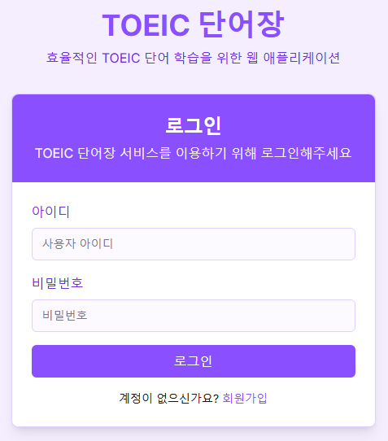
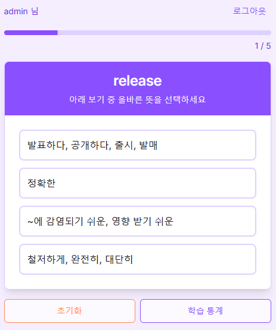
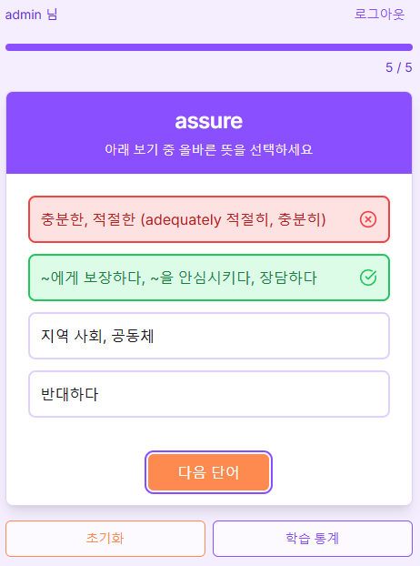
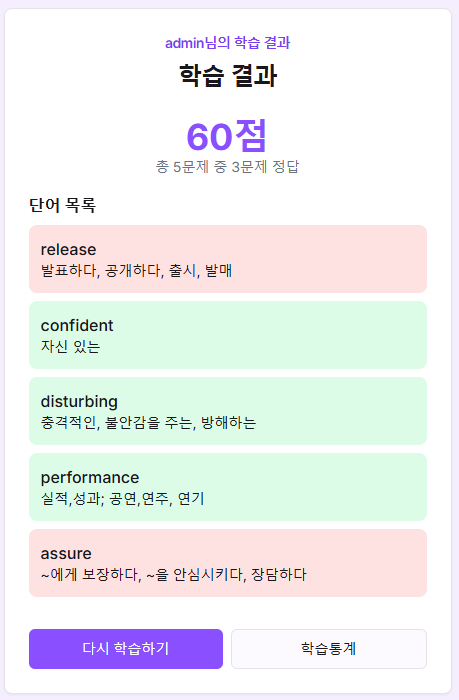
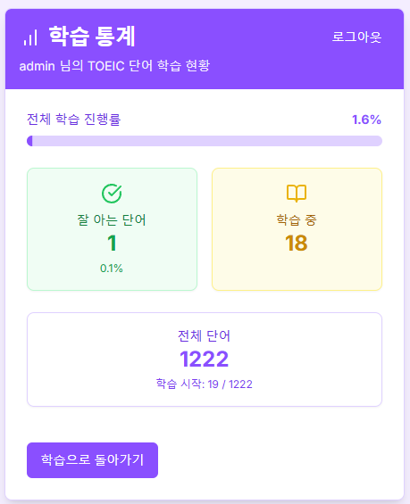

# TOEIC 단어장

TOEIC 단어 학습을 위한 웹 애플리케이션입니다. 사용자별 학습 이력을 기반으로 효율적인 단어 학습을 제공합니다.
본 저장소는 Vercel 배포용입니다.

AWS 클라우드 배포용 저장소 : https://github.com/seuthootDev/toeic-voca-aws
온 프레미스 배포용 저장소 : https://github.com/seuthootDev/toeic-voca-onprem

## 스크린샷

### 로그인 페이지


### 대시보드 페이지



### 학습 결과 페이지


### 학습 통계 페이지


## 주요 기능

- 사용자별 맞춤형 단어 학습
- 학습 이력 기반의 가중치 시스템
- 반응형 디자인으로 모바일/데스크톱 지원
- 사용자 인증 시스템 (로그인/회원가입)

## 기술 스택

- **프론트엔드**
  - Next.js 13 (App Router)
  - TypeScript
  - Tailwind CSS
  - React Hooks
  - Shadcn/ui 컴포넌트

- **백엔드**
  - Next.js API Routes
  - MongoDB
  - JWT 인증

## 시작하기

### 필수 조건

- Node.js 18.0.0 이상
- MongoDB 계정

### 설치

1. 저장소 클론
```bash
git clone [repository-url]
cd toeic-voca
```

2. 의존성 설치
```bash
npm install --legacy-peer-deps
```

3. 환경 변수 설정
`.env.local` 파일을 생성하고 다음 변수들을 설정합니다:
```
MONGODB_URI=your_mongodb_connection_string
JWT_SECRET=your_jwt_secret
```

4. 개발 서버 실행
```bash
npm run dev
```

## 프로젝트 구조

```
toeic-voca/
├── app/                    # Next.js 13 App Router
│   ├── login/             # 로그인 페이지
│   ├── register/          # 회원가입 페이지
│   └── dashboard/         # 대시보드 페이지
├── components/            # 재사용 가능한 컴포넌트
├── lib/                   # 유틸리티 함수
├── pages/                 # 서버리스 API
└── public/                # 정적 파일
```

## API 엔드포인트

- `POST /api/login` - 사용자 로그인
- `POST /api/register` - 사용자 회원가입
- `GET /api/words` - 학습할 단어 목록 조회